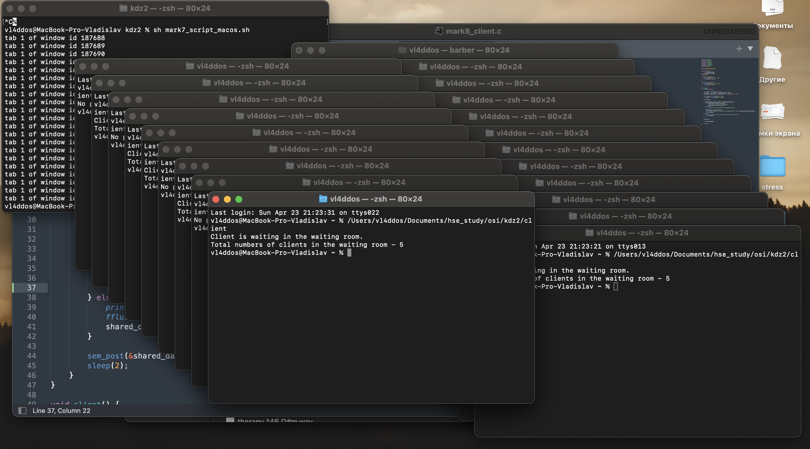
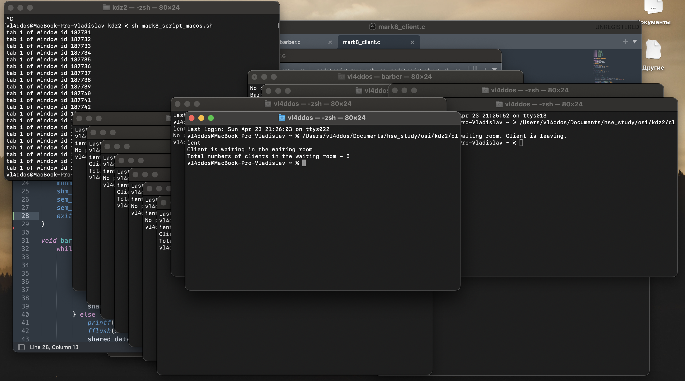

# Домашнее задание по ОС #2
## Сизикин Владислав Олегович (БПИ218), Вариант 1

## Задача:
    Задача о парикмахере. В тихом городке есть парикмахерская. Салон парикмахерской мал, работать в нем нем может только один парикмахер, обслуживающий одного посетителя. Есть несколько кресел для ожидания в очереди. Парикмахер всю жизнь обслуживает посетителей. Когда в салоне никого нет, он спит в кресле. Когда посетитель приходит и видит спящего парикмахера, он будет его, садится в кресло, «засыпая» на тот момент, пока парикмахер обслуживает его. Если посетитель приходит, а парикмахер занят, то он встает в очередь и «засыпает». После стрижки парикмахер сам провожает посетителя. Если есть ожидающие посетители, то парикмахер будит одного из них и ждет пока тот сядет в кресло парикмахера и начинает стрижку. Если никого нет, он снова садится в свое кресло и засыпает до прихода посетителя. Создать приложение, моделирующее рабочий день парикмахерской. Парикмахера и каждого из посетителей моделировать в виде отдельных процессов. Последние могут независимо порождаться в произвольное время и завершать работу после обслуживания.
    
## Компиляция:
    clang mark4.c -o mark4
    ...
    clang mark6.c -o mark6
    
## Запуск на 7-8 баллов
    Я сделал скрипты для Ubuntu и MacOS (тестирование проводил на MacOS, надеюсь, на Ubuntu все запускается :) )

    sh mark7_script_ubuntu.sh
    sh mark8_script_ubuntu.sh

## Выходные данные: 

Во время работы программа выводит логи в консоль, чтобы понимать, что происходит в текущий момент времени.

# 4 балла
В файле [mark4.c](code/mark4.c) находится решение задачи.

Множество процессов взаимодействуют с использованием именованных POSIX семафоров. Обмен данными ведется через разделяемую память в стандарте POSIX

Результат одного из запусков - [mark4.txt](logs/mark4.txt)

Процесс барбера отражает его работу - если клентов нет, то барбер спит, иначе же барбер начинает стричь клиента.

Процесс клиента симулирует, соответственно, клиента. Если в комнате ожидания есть место - клиент занимает место, иначе - уходит.

Размер комнаты ожидания я решил поставить равным 5.

# 5 баллов
В файле [mark5.c](code/mark5.c) находится решение задачи.

Множество процессов взаимодействуют с использованием неименованных POSIX семафоров расположенных в разделяемой памяти. Обмен данными также ведется через разделяемую память в стандарте POSIX.

Результат одного из запусков - [mark5.txt](logs/mark5.txt)

# 6 баллов
В файле [mark6.c](code/mark6.c) находится решение задачи.

Множество процессов взаимодействуют с использованием семафоров в стандарте UNIX SYSTEM V. Обмен данными ведется через разделяемую память в стандарте UNIX SYSTEM V.

Результат одного из запусков - [mark6.txt](logs/mark6.txt)

# 7 баллов
В файлах [mark7_barber.c](code/mark7_barber.c) и [mark7_client.c](code/mark7_client.c) находится решение задачи.

Приложение состоит из отдельных программ–процессов, запускаемых независимо друг от друга

Множество независимых процессов взаимодействуют с использованием именованных POSIX семафоров. Обмен данными ведется через разделяемую память в стандарте POSIX.

Скриншот запуска и вывод лога барбера:

[Лог барбера](logs/mark7_barber.txt)

# 8 баллов
В файлах [mark8_barber.c](code/mark8_barber.c) и [mark8_client.c](code/mark8_client.c) находится решение задачи.

Приложение состоит из отдельных программ–процессов, запускаемых независимо друг от друга

Множество независимых процессов взаимодействуют с использованием семафоров в стандарте UNIX SYSTEM V. Обмен данными ведется через разделяемую память в стандарте UNIX SYSTEM V.

Скриншот запуска и вывод лога барбера:

[Лог барбера](logs/mark8_barber.txt)
